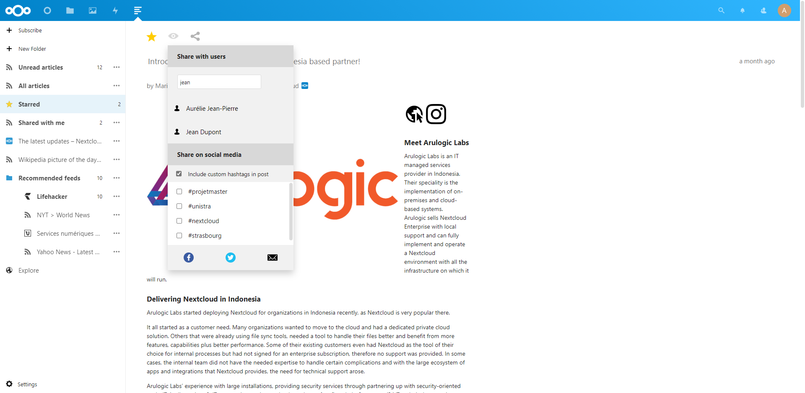

# Nextcloud News app - Team Forward Update Showcase

   [](https://codecov.io/gh/nextcloud/news/)

The News app is an RSS/Atom feed aggregator. It offers a [RESTful API](https://github.com/nextcloud/news/tree/master/docs/externalapi/Legacy.md) for app developers. The source code is [available on GitHub](https://github.com/nextcloud/news)

## Install
### Regular installation
See the [install document](https://github.com/Team-Forward/news/blob/master/docs/install.md)
### Docker
Get the image including the Team Forward release of Nextcloud News:
```
docker pull mnassabain/nextcloud-news
```
See the [full guide](https://github.com/nextcloud/docker/blob/master/README.md) on setting up a functional Nextcloud server.

## Team Forward Project Showcase

### Details

This repository showcases the features implemented by Team Forward for the 2020/2021 Masters Degree Project.
This repository is a fork of the [Nextcloud News App](https://github.com/nextcloud/news) containing new useful features.
Some of these features were integrated into the official News project.

The following features are implemented in this version:
1. Share an article with nextcloud users
2. Share an article on social media
3. Set default feeds
4. Define custom hashtags for posts

For more details, view the [share feature documentation](https://github.com/Team-Forward/news/blob/master/docs/featureShare/README.md).

### Team members
* Marco Nassabain
* Nicolas Wendling
* Aurélien DAVID
* Jimmy HUYNH
* Ilyes CHERGUI-MALIH
* Hamza ELHADDAD

## Screenshots


## Maintainers

* [Benjamin Brahmer](https://github.com/Grotax)
* [Sean Molenaar](https://github.com/SMillerDev)

### Special thanks to the Feed-IO library
Please consider donating to the developer of the RSS parser that powers nextcloud/news: [https://github.com/sponsors/alexdebril](https://github.com/sponsors/alexdebril)
